# 🚀 Technical Report: Spark Agent

---

## 📋 Executive Summary

The Spark Agent is an advanced agent that enables rich, interactive communication between AI models and live Jupyter notebooks through the Model Context Protocol (MCP). This extended version provides **several specialized tools** for comprehensive notebook manipulation, code execution, file management, and kernel interaction, significantly expanding upon the original 2-3 tools of the base implementation.

## 🏗️ Project Overview

### 🔑 Key Information

- **Repository:** Enhanced fork of Datalayer's jupyter-mcp-server
- **Primary Language:** Python (>=3.10 required)
- **Architecture:** Docker-containerized MCP server with WebSocket connections
- **Main Dependencies:** JupyterLab, jupyter_collaboration==2.0.1, pycrdt, FastMCP
- **Target Environment:** JupyterLab with collaborative editing support

### 🎯 Core Purpose

Bridge the gap between AI models and live computational environments, enabling seamless notebook manipulation through a well-defined protocol interface for complex data science workflows.

---

## ⚙️ Technical Architecture

### 🔧 Core Components

```mermaid
graph TB
    A[🤖 AI Model/Client] --> B[📡 MCP Server<br/>FastMCP]
    B --> C[📓 Notebook Client<br/>NbModelClient]
    B --> D[⚡ Kernel Client<br/>KernelClient]
    C --> E[🌐 WebSocket Connection]
    E --> F[📊 JupyterLab Instance]
    F --> G[📝 YJS Integration<br/>Real-time Sync]
    D --> H[🐍 Python Kernel]
    H --> I[💻 Code Execution]

    J[🐳 Docker Container] --> B
    J --> C
    J --> D

```

**Component Details:**

1. **MCP Server (`FastMCP`)** - Handles protocol communication and tool routing
2. **Notebook Client (`NbModelClient`)** - WebSocket connection to JupyterLab for real-time sync
3. **Kernel Client (`KernelClient`)** - Direct kernel communication for code execution
4. **YJS Integration** - Real-time collaborative document synchronization
5. **Docker Container** - Isolated execution environment with patched dependencies

---

## 🛠️ Available Tools

### 1. 📝 Cell Management Tools

| Tool Name | Description | Parameters | Usage |
|-----------|-------------|------------|-------|
| `get_all_cells` | Get all cell information | None | Notebook overview |
| `add_code_cell_at_bottom` | Append code cell to notebook end | `cell_content: str` | Adding new code snippets |
| `insert_cell` | Insert cell at specific index | `content: str, cell_type: str, index: int` | Precise cell placement |
| `delete_cell` | Remove cell by index | `cell_index: int` | Cleanup and organization |
| `edit_cell_source` | Modify cell content | `cell_index: int, new_content: str` | Code editing |
| `clear_notebook` | Remove all cells | None | Fresh start |

### 2. ⚡ Code Execution Tools

| Tool Name | Description | Parameters | Usage |
|-----------|-------------|------------|-------|
| `execute_cell` | Execute single cell (async) | `cell_index: int` | Run specific code |

### 3. 🔧 Utility Tools

| Tool Name | Description | Parameters | Usage |
|-----------|-------------|------------|-------|
| `internet_search` | Search web content | `query: str` | External information |

---

## 🎯 Use Cases

### 📊 Data Science Workflows

**Scenario:** Interactive data analysis with AI assistance

- AI can dynamically create cells for data loading, exploration, and visualization
- Real-time execution feedback allows for iterative analysis
- Collaborative editing enables team-based data science projects

**Example Flow:**

1. AI creates data loading cell with `add_code_cell_at_bottom`
2. Executes cell with `execute_cell` to validate data import
3. Inserts analysis cells at specific positions with `insert_cell`
4. Modifies existing analysis based on results using `edit_cell_source`

### 🤖 AI-Assisted Development

**Scenario:** Code generation and debugging support

- AI can write, test, and refine code in real-time
- Immediate execution feedback for code validation
- Systematic debugging through cell-by-cell execution

**Example Flow:**

1. AI generates initial code structure
2. Tests each component individually through `execute_cell`
3. Refines code based on execution results
4. Organizes final solution by inserting/editing cells

### 📚 Educational Content Creation

**Scenario:** Interactive tutorials and demonstrations

- Dynamic content generation based on learning objectives
- Real-time code execution for immediate feedback
- Collaborative notebook editing for group learning

**Example Flow:**

1. AI creates educational content with explanatory cells
2. Adds interactive code examples
3. Executes examples to demonstrate concepts
4. Modifies content based on learner feedback

### 🔬 Research and Experimentation

**Scenario:** Hypothesis testing and experimental workflows

- Systematic experiment design through structured cell organization
- Real-time result analysis and interpretation
- Collaborative research environment

**Example Flow:**

1. AI designs experiment structure with multiple cells
2. Executes experiments sequentially
3. Analyzes results and generates insights
4. Refines experimental approach based on findings

---

## 🔧 Setup and Installation

### 📋 Prerequisites

- **🐍 Python:** >= 3.10 (recommend Conda environment)
- **🐳 Docker:** For containerized execution
- **📊 JupyterLab:** Running instance with collaboration extension
- **🤖 MCP Client:** Such as Claude Desktop

---

## 🎯 Conclusion

The Spark Agent represents a sophisticated agent for AI-driven notebook interaction, providing comprehensive tools for code execution and file management. Its robust architecture, extensive error handling, and real-time synchronization capabilities make it suitable for complex data science workflows and interactive AI assistance scenarios.

The agent successfully bridges the gap between AI models and live computational environments, enabling seamless notebook manipulation through a well-defined protocol interface. With its extensive tool suite and production-ready features, it serves as a powerful foundation for AI-assisted data science and research workflows.
